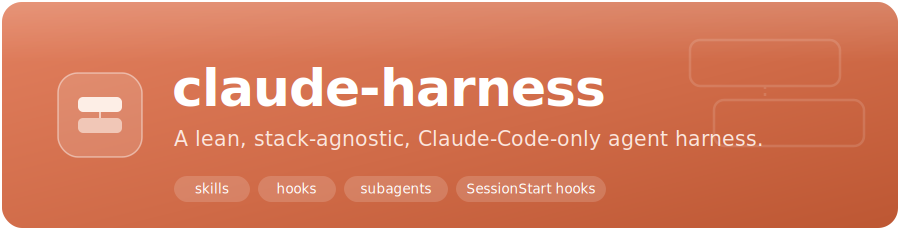
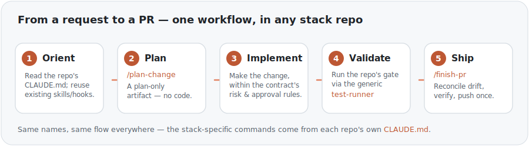
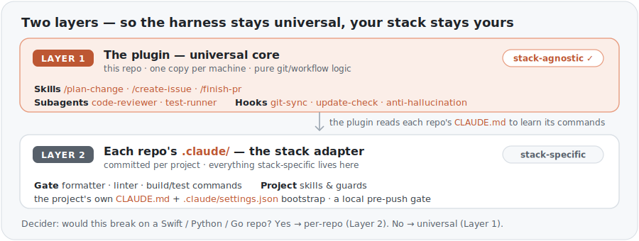

<div align="center">



<br/><br/>

[](https://github.com/JDSavvy/claude-harness/actions/workflows/ci.yml)
[](https://github.com/JDSavvy/claude-harness/releases)
[](LICENSE)


**[What it is](#what-it-is)** · **[Quick start](#quick-start)** · **[Two-layer model](#the-two-layer-model)** · **[What's inside](#whats-inside)** · **[Adopt it](#adopt-it-in-your-repo)** · **[Quality](#quality--releases)**

</div>

---

## What it is

A Claude Code plugin **marketplace** holding a single plugin, `harness`. An _agent harness_ is the set of
**skills, hooks, and subagents that shape how the agent works** — the workflow, not the code it writes. The
goal is one thing: give an agent in **any** repo the same calm, reviewable path from a request to a PR —
**orient → plan → implement → validate → ship** — without improvised git mistakes, whatever the stack.

<div align="center">
  
</div>

It is deliberately **lean and auditable**: a thin set of text files, zero runtime dependencies, no build
step, and no GitHub CI compute imposed on the repos that use it.

## Quick start

**Interactive (one-time per machine):**

```
/plugin marketplace add https://github.com/JDSavvy/claude-harness.git
/plugin install harness@claude-harness
```

**Repo-committed bootstrap** — add to the project's `.claude/settings.json` so clones are prompted to
install on folder-trust:

```json
{
  "extraKnownMarketplaces": {
    "claude-harness": {
      "source": { "source": "git", "url": "https://github.com/JDSavvy/claude-harness.git" },
      "autoUpdate": false
    }
  },
  "enabledPlugins": { "harness@claude-harness": true }
}
```

> [!IMPORTANT]
> The snippet defaults to **`autoUpdate: false`** — the **safe default**: you pin the installed version and
> update deliberately, after review, via `/plugin marketplace update claude-harness`. With `autoUpdate: true`
> each session start refreshes from the mutable `main` branch and **runs whatever `main` currently is —
> including its SessionStart hooks — before you can review it**. Set `true` **only** for a purely-local,
> low-privilege session; keep it `false` for any repo holding secrets/tokens, MCP credentials, or CI
> privileges. Full heuristic: [`docs/VERSIONING.md`](docs/VERSIONING.md).

Skills are invoked **namespaced** — `/harness:plan-change`, `/harness:create-issue`, `/harness:finish-pr`.

<details>
<summary><b>Use it inside the <code>@claude</code> GitHub Action</b></summary>

<br/>

Add these inputs to your existing authenticated `anthropics/claude-code-action` step's `with:` block — they
sit alongside its `claude_code_oauth_token` (auth comes from your existing setup):

```yaml
with:
  # ... your existing claude_code_oauth_token ...
  plugin_marketplaces: https://github.com/JDSavvy/claude-harness.git
  plugins: harness@claude-harness
```

</details>

## The two-layer model

The harness stays **universal** while your stack stays **yours**: the plugin is the stack-agnostic core
(Layer 1), and each repo's committed `.claude/` is the stack adapter (Layer 2). The plugin reads each
repo's `CLAUDE.md` to learn its commands — so the same skill names work everywhere.

<div align="center">
  
</div>

> **Decider:** _would this break on a Swift / Python / Go repo?_ If **yes**, it is per-repo and never lives
> in the plugin.

<details>
<summary>Shared vs per-repo, as a table</summary>

<br/>

| Shared — this plugin                                                | Per-repo — each project's `.claude/`                          |
| ------------------------------------------------------------------- | ------------------------------------------------------------- |
| `/plan-change`, `/create-issue`, `/finish-pr` skills                | Formatter, linter, dependency install                         |
| Generic `code-reviewer`, `test-runner` subagents                    | The quality-gate commands (lint / build / test)               |
| Generic `SessionStart` hooks (git-sync, update-check, AH reminder)  | Project-specific skills and specialized subagents             |
| Pure git/workflow logic, zero stack assumptions                     | The project `CLAUDE.md` and `.claude/settings.json` bootstrap  |

</details>

## What's inside

| Element                       | What it does                                                                                              | Opt-out                    |
| ----------------------------- | --------------------------------------------------------------------------------------------------------- | -------------------------- |
| `/plan-change`                | Orient + plan a change in-session (orientation → changes → validation → risk class → delivery) — no code/git | —                          |
| `/create-issue`               | Turn a goal into a researched, best-practice GitHub issue — no code; ends at the issue                    | —                          |
| `/finish-pr`                  | Drive a PR to merge-ready: reconcile against drift (merge base, never rebase), implement, verify, push once | —                          |
| `code-reviewer`               | Opus subagent — reviews correctness, security, performance, reuse                                          | —                          |
| `test-runner`                 | Sonnet subagent — runs the repo's lint + build + test gate                                                 | —                          |
| `session-git-sync`            | Bounded fetch + ahead/behind/dirty notify; safe `git merge --ff-only` only when clean & strictly behind, with a forensic audit line (`+N` and `old→new` HEAD) | `HARNESS_GIT_SYNC=off`     |
| `harness-update-check`        | Throttled (~daily) `ls-remote` check; notifies (never auto-updates) when the plugin is behind             | `HARNESS_UPDATE_CHECK=off`  |
| `anti-hallucination-reminder` | Injects the universal "verify before asserting, incl. negative claims" rule into every session            | `HARNESS_AH_REMINDER=off`   |

> Plugin skills are namespaced — invoke them as **`/harness:<name>`** (e.g. `/harness:plan-change`). The
> bare `/name` forms above are shorthand.

## Adopt it in your repo

The plugin (Layer 1) is generic; your repo supplies the stack adapter (Layer 2). Copyable, stack-neutral
starting points live in [`docs/templates/`](docs/templates/) — fill the marked `<SLOT>`s:

1. **Enable the plugin** — add the bootstrap above to `.claude/settings.json`; pick `autoUpdate` by
   privilege ([`docs/VERSIONING.md`](docs/VERSIONING.md)).
2. **Write your `CLAUDE.md`** — copy [`consumer-CLAUDE.md.template`](docs/templates/consumer-CLAUDE.md.template)
   and fill in the stack/commands, conventions, and any per-repo additions to the universal _Risk &
   Approval_ and _Definition of Done_. The generic `test-runner` / `code-reviewer` read this file to learn
   your gate — keep the commands accurate.
3. **Wire a local pre-push gate** (no CI compute imposed on you) — either
   [`lefthook.yml.example`](docs/templates/lefthook.yml.example) (recommended; one Go binary,
   language-agnostic) **or** the zero-dependency
   [`githooks-pre-push.example`](docs/templates/githooks-pre-push.example).
4. **(Optional) Activate the PreToolUse guard** to hard-block your sharp, project-specific cases ↓.

<details>
<summary><b>Per-repo enforcement: the PreToolUse guard</b></summary>

<br/>

The universal _Risk & Approval_ floor (in [CLAUDE.md](CLAUDE.md)) is a behavioural contract. To turn the
**sharp, project-specific** cases into _hard blocks_, the plugin ships a copyable **PreToolUse guard
template**, [`pretooluse-guard.sh.template`](plugins/harness/hooks/templates/pretooluse-guard.sh.template).
It demonstrates blocking dangerous Bash (`rm -rf`, `git push --force`/`-f`, `git reset --hard`), writes to
`.env*` secret files, and an off-limits MCP/service reference (a clearly-marked placeholder you fill in).

It is **not** active by default — deliberately **not** registered in the plugin's `hooks.json`, so a sharp
guard never runs unreviewed in every repo. Activate it per-repo, on purpose:

```sh
# Copy the template out of the harness plugin (your marketplace clone, e.g. under ~/.claude/plugins/…)
# into your repo — replace <harness> with that location:
cp <harness>/hooks/templates/pretooluse-guard.sh.template .claude/hooks/pretooluse-guard.sh
chmod +x .claude/hooks/pretooluse-guard.sh
# then replace each __REPLACE_ME_* placeholder with your repo's real off-limits refs (or delete that block)
```

Register it in `.claude/settings.json` (an **empty** `matcher` fires on _all_ tools, so the guard also
sees MCP calls):

```json
{
  "hooks": {
    "PreToolUse": [
      {
        "matcher": "",
        "hooks": [
          { "type": "command", "command": "bash \"$CLAUDE_PROJECT_DIR\"/.claude/hooks/pretooluse-guard.sh" }
        ]
      }
    ]
  }
}
```

A blocked call returns the documented `permissionDecision: "deny"` and a visible `harness guard: blocked — …`
audit line. The guard **fail-safes** (exits 0 with no decision when it can't positively identify a blocked
pattern, so your normal permission flow still applies) and is bash-3.2-portable. Opt-out: `HARNESS_GUARD=off`.

</details>

## Quality & releases

After `bash scripts/setup.sh` (once per clone), a local quality gate runs on every commit (pre-commit via
`.githooks/`). The **same** [`scripts/validate.sh`](scripts/validate.sh) runs locally and in this repo's free
read-only CI — it checks the JSON manifests, the single-sourced version, `bash -n` + `shellcheck` on the
hooks + templates, `claude plugin validate`, skill/agent frontmatter, `hooks.json` reference integrity, the
marketplace → plugin consumption wiring, **bash-3.2 multibyte-safe interpolation**, and every
`tests/*.test.sh`. CI runs it on **both Linux and macOS** — the macOS job exercises the system **bash
3.2.57** path the hooks must stay portable to. Node-free; bypassable with `git commit --no-verify`.

Releases are automated via **release-please** (Conventional Commits → release PR → on merge, tag + GitHub
Release). The version is single-sourced in `plugins/harness/.claude-plugin/plugin.json` — never in
`marketplace.json`. No GitHub CI compute is imposed on consumer repos; this public repo's own CI and
release-please are the deliberate exception.

## Contributing

See [CONTRIBUTING.md](CONTRIBUTING.md) for the workflow, [`CLAUDE.md`](CLAUDE.md) for the hard rules and the
harness contract, and [`docs/HARNESS-SETUP.html`](docs/HARNESS-SETUP.html) for an illustrated install walkthrough.

<div align="center">
<br/>
<sub>Built for <a href="https://docs.claude.com/en/docs/claude-code">Claude Code</a> · <a href="LICENSE">MIT</a> © 2026 JDSavvy</sub>
</div>
